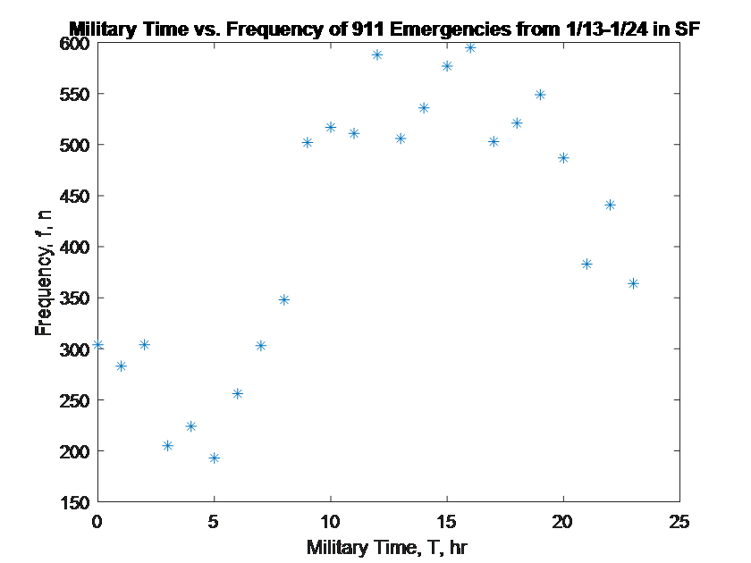
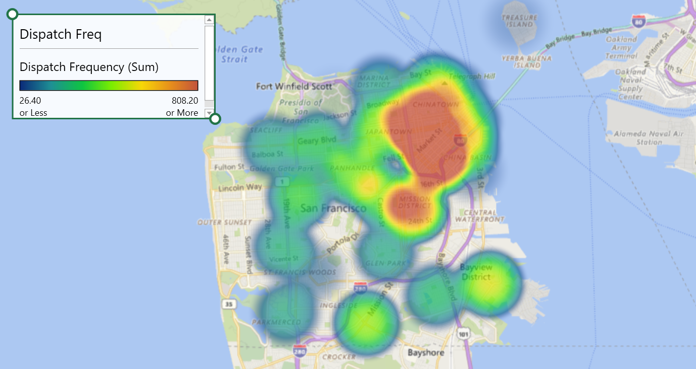
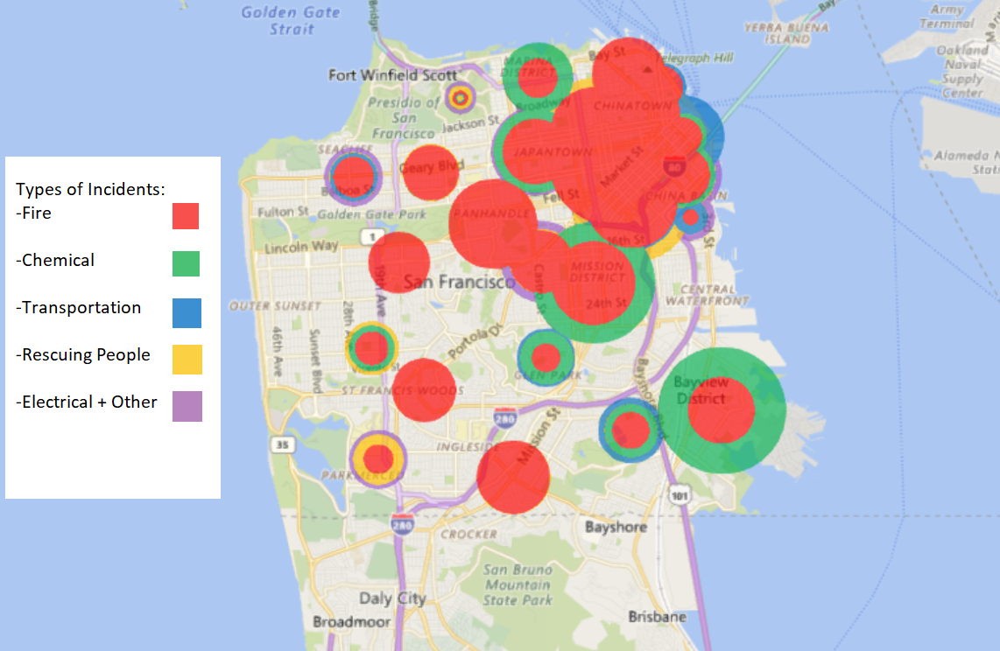
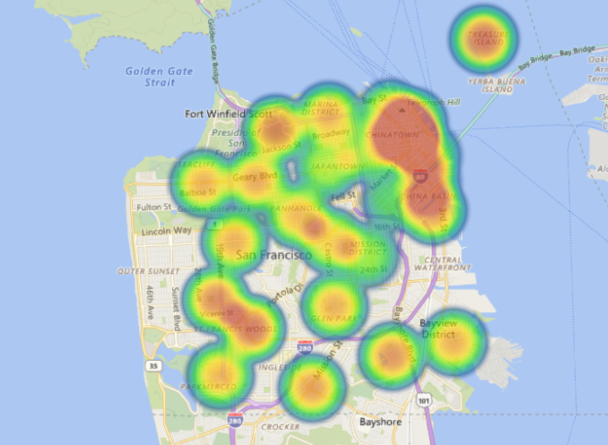

# Optimizing and Predicting Emergency Calls in San Francisco

My name is Numan Khan and the purpose of this project was to analyze and display trends in public data from the San Francisco Fire Department that contained dispatch information for emergency calls, with call time, location, dispatch. 


## Question 1

Data Visuals: Display or graph 3 metrics or trends from the data set that are interesting to you.

When looking at all of the dispatch data provided, I was interested in specifically analyzing the timestamp data. One of the goals for this project was optimization of the dipatch process. Therefore, I was eager to depict three trends that had to do with the amount of time different parts of the dispatch process took. The trends I looked into were the amount of time an operator takes to dispatch an emergency vehicle, the amount of time a unit takes from receiving a dispatch to arriving on scene, and the amount of time an ambulance takes to reach the nearest hospital.


<p align="center">
  
</p>


Analyzing the data from this graph, the average of the reaction times of operators in San Francisco's Fire Department was 3.75 minutes. The standard deviation of this data was 20.18, in other words, the reaction times of 911 operators are extremely spread over a wide range. 


<p align="center">
  
</p>


Analyzing the data from this graph, the average time of the dispatched unit reaching the location of the incident was 4.63 minutes. The standard deviation of this data was 5.52, therefore, the amount of time vehicles to reach the location of the incident is much closer to the mean than the previous trend.


<p align="center">
  
</p>


Analyzing the data from this graph, the average time of an ambulance reaching the nearest hospital was 4.44 minutes. The standard deviation of this data was 7.81, therefore, the amount of time ambulances took to reach the hospital was somewhat varied and away from the mean.

For further information on the data visuals, look at operatorTime.py, dispatchTime.py, or ambulanceTime.py.

Another metric that I was interested in looking to was the number of incidents that occur throughout the day. I ended up writing a Java program (Daily911CallFreq.java) that parsed the data into a HashMap. Essentially, it recorded the number of incidents for each our of the day for all 10000 records. This data was then plotted using MatLab (displayDaily911Calls.m):


<p align="center">
  
</p>


Something that is noticeable is that there is a clear spike in the number of 911 calls from 10 AM to 8 PM.


## Question 2

Given an address and time, what is the most likely dispatch to be required?


Addressing this problem required properly understanding how to group data, store data, access data, and finally displaying it to the user. Essentially the user would enter an address such as "700 44TH AVE SF" and then enter a military-time such as "12". The script would the map of occurances of each type of call_type in a unique hour of the day which is in a unique zip code. The script then determines the most likely dispatch required and displays it to the user. Here is a sample run:

```markdown
Sample run of dispatchPredictor.py

Given an address and time, what is the most likely dispatch to be required?

Please enter an address (EX: 700 44TH AVE SF): 1700 CALIFORNIA ST SF

Please enter a time of day (military time): 23:47

Most likely dispatch to be required: Medical Incident
```

The Python script for this question can be found in dispatchPredictor.py. 


## Question 3

Which areas take the longest time to dispatch to on average? How can this be reduced?


This question was tackled by determining the unique zipcodes of the data provided and determines the reponse time for each incident. The next step was calculating the average response time for each unique zipcode. To answer the question, the bounds for being considered an outlier was found from the average response time for each zipcode. Any average response time greater than 7.69 minutes was an outlier. There ended up being 4 different zipcodes that had average response times that were greater than 7.69. 94134: 


```markdown
Sample run of avgResponseTime.py
Which areas take the longest time to dispatch to on average? How can this be reduced?


This a dictionary of each zipcode and its avg response time: 
{94121: 6.280353817504653, 94103: 5.846473601260835, 94122: 5.884038461538464, 94109: 5.06258346173601, 94107: 6.05615212527964, 94110: 5.542024539877302, 94102: 5.909789644012945, 94133: 5.491251384274642, 94134: 7.968085106382977, 94111: 6.252311435523113, 94114: 5.283563218390805, 94131: 6.047123015873015, 94117: 4.833105022831049, 94112: 6.258285714285713, 94118: 5.142933947772657, 94158: 6.076315789473684, 94105: 7.351729559748429, 94115: 5.241271929824567, 94108: 5.377129629629629, 94124: 7.041384863123986, 94104: 5.697413793103449, 94116: 6.584615384615386, 94123: 5.41199040767386, 94127: 10.359523809523806, 94132: 7.011439842209073, 94130: 8.586458333333333, 94129: 9.572839506172839}


These avg response times are outliers: 
7.968085106382977
10.359523809523806
8.586458333333333
9.572839506172839


Areas that take the longest time to dispatch on average:
94134: 7.97 min
94127: 10.36 min
94130: 8.59 min
94129: 9.57 min
```


One way that the average time to dispatch can be reduced is authorities finding better ways to alert current vehicles in the path of dispatched unit to move out of the way such as doing something to the traffic signal. Another way is by simply reducing the time operator takes to dispatch a unit in the first place. This could be accomplished through software that can automatically parse phone call and entered them into the database. 


## Bonus Features
### Heatmap

Add heat maps that show dispatch frequency, urgency over the city.


<p align="center">
  
</p>

This heat map specifically show the dispatch frequency in the San Francisco from 1/13 to 1/24. One conclusion that can be made from it is as that northeast corner of San Francisco, such as the Mission District, Chinatown, Japantown, and the China Basin, seems to be having the most emergency calls. 


<p align="center">
  
</p>

This heat map takes the previous heat map of dispatch frequency and breaks it down into different categories of emergency call types.

<p align="center">
  
</p>

This heat map displays the safe neighborhoods in the San Francisco area. This map was created by acknowledging that the type of dispatch call closest to a crime would be "Alarms". The number of alarm related dispatch calls was summed up for each unique zipcode. However, this data would show the crime heavy areas--not the safe neighborhoods. Therefore, subtracting all of the occurances of alarm dispatch calls from 200 would show us the opposite data--safe neighborhoods. The number 200 was chosen because the greatest amount alarm call for zipcode 94102 was 148. Therefore, 94102 would have a lower value comparative to other zipcodes.
